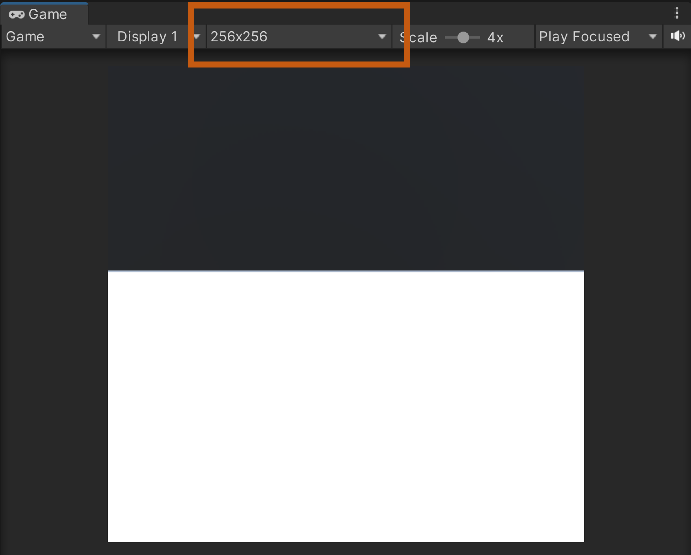

# DetermiNet

DetermiNet is a visuolinguistic dataset based on the word class "determiners". It aims to develop understanding of using determiners for referring expressions.

This is the code used to the DetermiNet dataset as described in the paper: 
https://openreview.net/pdf?id=UO1e-ReZ4IT
Presented at ____

You may use the code to generate synthetic images and text pairings to determiner phrases, such as the following: 

### DetermiNet Dataset 

### Setup 
- Setup Unity Hub as per https://docs.unity3d.com/hub/manual/InstallHub.html
- Install Unity Editor 2021.3.9f1
- Install required packages
```
pip install -r requirements.txt 
``` 

## Generating the dataset
#### Option 1: Through the Unity Editor 
1. open up the unity project under "DetermiNetProject" directory 
2. Setup the resolution to the image resolution that you want to generate (256 x 256)

3. run setup.py
```
// assume in root directory of the repository 
cd DetermiNetProject/Assets/utils
python setup.py
```
4. Click play on the unity editor to run the generation script 


## Retraining the models 
### Neurosymbolic model
This section elaborates how you can rerun the Neuro-symbolic model which were explained 

### MDETR/OFA
For [MDETR](https://github.com/ashkamath/mdetr) and [OFA](https://github.com/OFA-Sys/OFA), you may refer to the repositories in the link to run the baseline models. we have also included the json files that we used in the preprocessed_data directory 

## Evaluation scripts 
### Evaluating baselines 
To reproduce the results we showed in the paper, you can run coco evaluation for mAP based on the jsons we generated in both ground_truths and predictions directories. 

You may run the following code to see the evaluation results for our Neurosymbolic model, MDETR and OFA 
```
cd evaluation 
python evaluation_baseline.py 
```

### Evaluating on new models using corrected ground truth 
To run on corrected evaluation first save your predictions as specified by the coco format in ./predictions as {model_name}_pred_results.json.

Afterwards, run the evaluation script as below, changing the model_name parameter to your desired name, this script will generate the corrected ground truth file under ground_truths using the model name and evaluate against the predictions in the predictions folder.

```
cd evaluation 
python evaluate.py --model_name=ns
```

